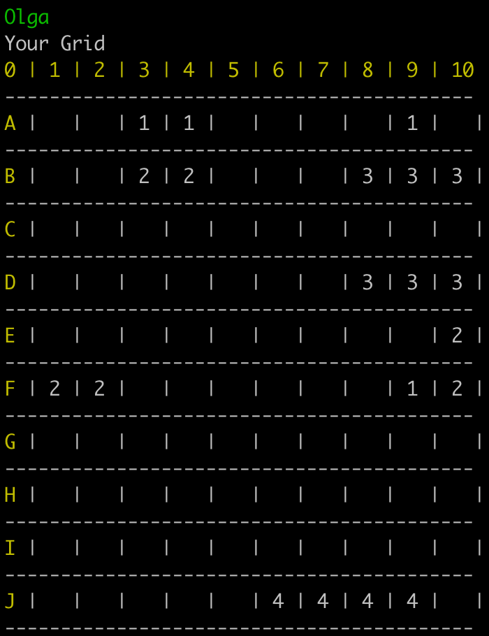
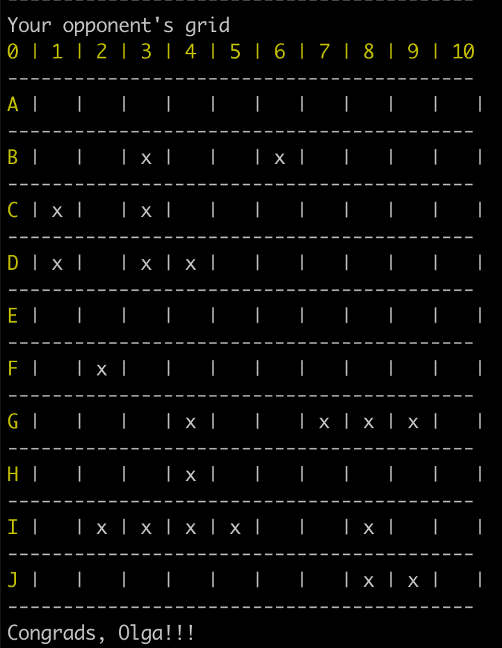

# Battleship game

  To start the game:
  * run `bundle install`
  * run `ruby code.rb`

## Implementation of the game "Battleship" in terminal

- game has two players
- there is two types of players: Human and Computer
- when game starts players should add their names. If you type 'C' instead of name the player is set as Computer player
- each player has collection of ships (it is stored in `Player::SHIPS_TYPES` constant)
- ships will be arraged randomly using method `Player#arrange_ships`
- player see two boards: his own and the opponent's board
- numbers on the own board mean size of a ship ('battleship' - 4, 'cruiser' - 3, 'destroyer' - 2, 'submarine' - 1)
- players switch turn alternately (1 shote at the time)
- input accepted in format [letter + number] (example => "A5", "J10")
- when input doesn't match the conditions player would be asking "Try again"
- after each shot player sees a message with results of a shot (for example 'Hit' when success, 'Miss' when miss)
- when player hit, his score is increasing by 1 point and on his opponent's board appear 'x'
- maximum score is equal to spaces of all ships (in my game 20)
- player wins when he reached maximum score

Video
https://www.loom.com/share/8da26ca53cf741f4a268afe34bbbe1fd
